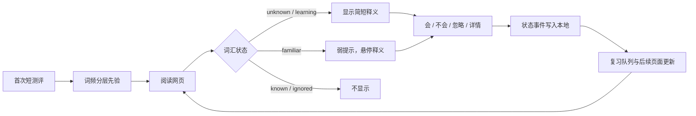

> [!CAUTION]
> 本文件已经废弃，仅保留为历史记录。它包含“不接本地模型、固定 48–64 题、同 lemma 状态传播”等过期设计，不得用于实现。请从同目录 `README.md` 进入当前文档。

# 浏览器词汇学习插件：V0.1 产品规格与开发计划

状态：待确认后进入实现

范围：Chrome Manifest V3、英语网页阅读、简体中文释义、本地优先

产品定位：持续维护用户“具体认识哪些词”的个人词汇模型，并只在需要时显示阅读脚手架；掌握后撤除提示。

## 1. 目标与非目标

### 目标

1. 用户完成一个短测评后，系统获得按词频层级表达的初始词汇先验，而不是伪造一份“已知词清单”。
2. 用户阅读英文网页时，插件只为疑似不认识或正在学习的词提供提示。
3. 用户可以在网页内即时纠错：`我会`、`不会`、`忽略`、`查看释义`；同一页面的显示立即同步。
4. 用户通过复习确认掌握后，词的提示逐步变弱并最终默认隐藏；遗忘时能重新激活。
5. 词汇状态、测评与复习数据全部保存在本机；V0.1 无账号、无服务端、无网页内容上传。

### 非目标（明确不做）

- 完整网页翻译、双语对照或字幕翻译。
- 云同步、登录、社交功能、移动端、多语言学习。
- 在 V0.1 接入 Ollama 或 LM Studio；它们只预留可替换的翻译模块接口，避免阻塞核心闭环。
- 承诺用一次测试准确得出用户认识的每一个单词。
- 自动把“出现次数多”的词直接判定为已掌握。

## 2. 验收标准

| 编号 | 可验证结果 |
| --- | --- |
| AC-01 | 新用户可完成 48–64 题的分层测评；结果给出词汇量区间、置信度及词频层级掌握概率。 |
| AC-02 | 页面中用户标为 `known` 的词及其同一 lemma 词形，在当前页立即取消提示；刷新后仍保持。 |
| AC-03 | 用户可选中一个未标注英文词并标为 `unknown`；以后遇到该 lemma 时出现提示，并进入复习队列。 |
| AC-04 | `ignored` 词在后续扫描中永不标注；允许在词库中撤销。 |
| AC-05 | `unknown`、`learning`、`familiar`、`known`、`ignored` 状态有可测试的转移记录；一次曝光绝不自动升为 `known`。 |
| AC-06 | 在 1,500 词左右的静态文章中，首次可见区处理不阻塞页面交互；目标为主线程单批处理不超过 16ms，超出时让出执行权。 |
| AC-07 | 无网络、无本地模型时，已缓存的词库和本地词典释义仍可工作；不因翻译失败破坏原网页。 |

## 3. 核心用户流程



### 网页交互

- 标注形式：词后显示简短中文释义或弱下划线；默认不改变原文的段落结构和行高。
- 轻量卡片：悬停/点击显示词元、词性、释义和四个动作：`我会`、`不会`、`忽略`、`详情`。
- 漏标：用户选中英文单词后，扩展菜单提供“加入生词”。
- 即时撤销：每次状态变更显示短暂“撤销”入口。

### 测评与复习

- 测评按 6–8 个词频层级抽样，混入约 10% 伪词；答案为“确定认识 / 好像认识 / 不认识 / 看过但想不起”。
- 测评输出的是层级概率和不确定词集合；浏览反馈优先校准不确定区间。
- 复习只测试词义回忆或辨义；正确复习按间隔重复推进，错误或主动标记不会则降级。

## 4. 词汇状态模型

### 对外状态

| 状态 | 含义 | 阅读呈现 |
| --- | --- | --- |
| `unknown` | 用户明确不会或复习失败 | 显示释义 |
| `learning` | 正在建立记忆 | 显示释义 |
| `familiar` | 多次复习正确但未稳定 | 弱提示，悬停释义 |
| `known` | 已稳定掌握或用户手动确认 | 不显示 |
| `ignored` | 人名、术语、代码、噪声等 | 不显示 |

内部用 `uncertain` 表示没有用户明确反馈的候选词；它不应被展示为“用户不会”。

### 状态转移（第一版）

```text
uncertain --用户标不会/加入生词--> unknown
unknown --查看释义或开始复习--> learning
learning --间隔复习连续正确--> familiar
familiar --间隔复习连续正确--> known
任一状态 --用户标忽略--> ignored
known/familiar --用户标不会或复习错误--> learning
任一状态 --用户标我会--> known（记录 manualKnown，仍允许未来降级）
```

默认晋级规则：学习后至少在 D+1、D+3、D+7、D+14 四次复习正确才进入 `known`。具体 SRS 算法是实现细节，不能泄漏到网页标注模块。

## 5. 技术设计

### 架构

```text
Content Script
  - 找到可处理文本、词元包装、网页内反馈
  - 不直接访问 IndexedDB 或翻译端点
             │ runtime message
Extension Worker
  - 协调词汇状态、扫描决策、缓存、复习调度
  - 唯一持久化与翻译调用入口
       ┌─────┴─────┐
       ▼           ▼
Vocabulary Store   Gloss Provider
IndexedDB          本地词典（V0.1）
                   Ollama / LM Studio（V0.3 Adapter）
       │
Side Panel
  - 测评、词库、复习、设置
```

### 深模块与 seam

模块接口应该小，复杂度由模块内部吸收：

| 模块 | Interface（供调用方使用） | 隐藏的实现复杂度 |
| --- | --- | --- |
| `VocabularyEngine` | `classify(lemmas)`、`recordFeedback(event)`、`getReviewQueue()` | 先验、手动覆盖、复习状态、迁移与批量查询 |
| `PageAnnotator` | `annotate(root)`、`undoLastChange()`、`dispose()` | TreeWalker、词形映射、DOM 安全、增量扫描 |
| `AssessmentEngine` | `nextQuestion()`、`submit(answer)`、`result()` | 分层抽样、伪词、概率估计、反作弊校正 |
| `GlossProvider` | `lookup({lemma, sentence})` | 本地词典、缓存、未来本地模型调用与降级 |

仅在确有两种实现的地方设 seam：`GlossProvider` 在 V0.1 只有本地词典 adapter，但为 V0.3 预留；持久化层先不抽象多套 adapter，避免过度设计。

### 数据模型（摘要）

```ts
type WordStatus = 'unknown' | 'learning' | 'familiar' | 'known' | 'ignored'

interface WordProfile {
  lemma: string
  status: WordStatus
  manualOverride?: 'known' | 'unknown' | 'ignored'
  frequencyBand?: string
  exposureCount: number
  glossViewCount: number
  recallCorrect: number
  recallWrong: number
  nextReviewAt?: number
  firstSeenAt: number
  lastSeenAt: number
  updatedAt: number
}

interface VocabularyEvent {
  id: string
  lemma: string
  type: 'marked_known' | 'marked_unknown' | 'marked_ignored' | 'gloss_viewed' | 'reviewed'
  result?: 'correct' | 'wrong'
  source: 'assessment' | 'page' | 'review' | 'vocabulary_list'
  occurredAt: number
}
```

`VocabularyEvent` 是可审计事实；`WordProfile` 是可重建的当前投影。两者分开，才可解释“为什么这个词被显示”。页面原文、整页 URL 历史和完整句子默认不落库，降低隐私风险。

### 网页性能与兼容性约束

1. 用 `TreeWalker` 只遍历正文文本节点，排除 `script/style/code/pre/input/textarea/contenteditable`、扩展自身节点与隐藏节点。
2. 以 `IntersectionObserver` 优先处理视口及其附近区域；每批有限节点，使用 `requestIdleCallback`（有回退）让出主线程。
3. 以 `MutationObserver` 处理无限滚动；对已处理节点打不可冲突标记，防止重复包装。
4. 词库查询按 lemma 去重批量发给 Worker；绝不按单词逐条访问 IndexedDB。
5. 浮层置于 Shadow DOM；正文词标记只用最小化样式，避免污染网站 CSS 与无障碍语义。

## 6. 隐私、安全与权限

- 默认仅请求活动标签页上的临时站点访问权限，避免一开始申请“读取和修改所有网站”。
- 所有学习数据存 IndexedDB；导出必须由用户主动发起，格式为 JSON/CSV。
- V0.1 不把网页文本、词库或测评答案发送到网络。
- 将来本地模型调用只由 Extension Worker 访问 `127.0.0.1`；明确展示端口、模型名和本地内容会被发送给模型的范围。
- 代码、密码输入、支付页和用户配置的域名永不扫描。

## 7. 实施计划

| 里程碑 | 交付 | 完成条件 |
| --- | --- | --- |
| M0：工程骨架 | WXT + TypeScript + React、MV3、Side Panel、最小测试环境 | 打包并可在 Chrome 加载；空 Side Panel 与 content script 通讯可验证 |
| M1：词库闭环 | IndexedDB、状态事件、词库界面、手动已会/不会/忽略 | AC-02、AC-03、AC-04 通过 |
| M2：网页标注 | 安全文本扫描、lemma 归一化、提示卡与撤销、动态页面增量扫描 | 静态/动态网页 fixture 与性能门禁通过 |
| M3：测评与校准 | 分层题库、伪词、结果页、初始先验写入 | AC-01 通过，伪词不被计入已知词 |
| M4：复习与状态收敛 | 复习队列、间隔调度、升降级、可解释事件记录 | AC-05 通过 |
| M5：本地词典与体验收尾 | 离线释义、失败降级、导入导出、权限与隐私说明 | AC-06、AC-07 通过 |

## 8. 质量门禁

- 单元测试：状态转移、词形归一化、测评计分、SRS 调度、事件投影。
- DOM 测试：不处理禁止节点；二次扫描不重复包装；“我会”立即移除当前页同 lemma 提示。
- 浏览器集成测试：动态插入文本、Side Panel 到 Worker 通讯、IndexedDB 持久化。
- 性能基线：静态长文、无限滚动 fixture；记录候选文本节点数、处理批次数、最大单批耗时。
- 隐私门禁：测试网络请求为零；权限清单只保留 M0–M5 实际所需项。
- 无障碍检查：键盘可操作、浮层可关闭、颜色不是唯一状态表达。

## 9. 进入编码前必须确认的决策

1. 首个目标浏览器是否只支持 Chrome；推荐：是，MVP 后再扩展 Edge/Firefox。
2. V0.1 的释义是否接受离线英汉词典数据包；推荐：是，保证无网络可用。
3. 标注默认形式是“词后短释义”还是“仅下划线、悬停解释”；推荐：`unknown/learning` 短释义，`familiar` 仅下划线。
4. 初始测评长度：推荐 56 题、约 4–6 分钟，并允许中断后继续。
5. 是否将特定网站（例如 GitHub、技术文档）设为默认扫描对象；推荐：默认由用户在扩展按钮中对当前站启用，减少干扰与权限顾虑。

## 10. 下一步

确认第 9 节五项后，先完成 M0 与 M1，并以自动化测试验证词汇状态闭环；不接 LLM、不做账号系统。
