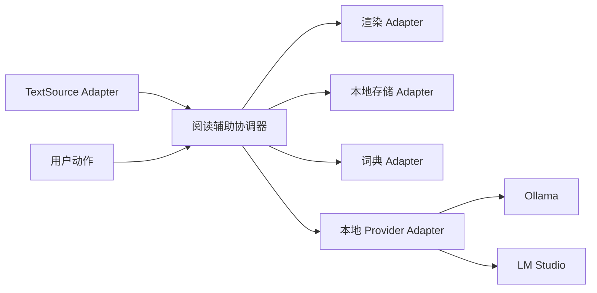
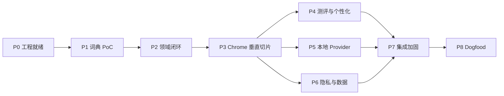

# 浏览器词汇学习插件 V0.1 开发计划

状态：最终规划基线；尚未授权实现。

上游：[V0.1 产品规格](v0.1-产品规格.md)、[RULES.md](../RULES.md)、[CONTEXT.md](../CONTEXT.md)。

下游：[V0.1 验收与测试计划](v0.1-验收与测试计划.md)。

## 1. 开发目标

交付一个供单用户长期 dogfood 的 Chrome 可加载扩展，跑通以下闭环：

```text
渐进测评 → 个性化提示 → 会/不会即时纠错 → 复测与保温抽检
     ↑                                              ↓
     └────────── 本地证据账本持续校准 ──────────────┘
```

V0.1 的完成标准不是“扩展能够加载”，而是词典数据可审计、页面交互稳定、个人模型不会因普通曝光伪造掌握，并能在真实使用中同时降低误提示、漏标和错误释义。

## 2. 架构与测试 seam

最高测试 seam 是**阅读辅助协调器**。其 Interface 接收规范化正文增量、当前个人状态和用户动作，返回标注决策、状态变更、复习候选与可选 Provider 任务。



核心规则集中在协调器内部。DOM、IndexedDB、词典格式和 Provider 协议不得渗入领域状态机。只有确实存在多个实现的地方才保留 Adapter：文本来源预留未来扩展；Provider 已有 Ollama/LM Studio；存储与词典需要内存测试实现和浏览器实现。

## 3. 工程就绪门

以下项目必须在写第一行生产代码前冻结：

- 技术栈、包管理器、扩展框架、UI 框架、IndexedDB 封装与测试工具；
- 本地仓库布局和真实的 format、lint、typecheck、unit、integration、E2E、build 命令；
- 代码审查基点；当前目录不是 Git 仓库，若仍不建立 Git，则必须以明确文件快照作为比较基点；
- Issue tracker 与 triage 标签；若采用多人/多会话实施，确认后显式执行 `/to-tickets`；
- 用户明确授权后才显式执行 `/implement`。

推荐但尚未升级为已确认规则的默认技术组合是：WXT、TypeScript、React（仅扩展页面）、Dexie/IndexedDB、Vitest、Playwright。P0 评审时可以接受该组合，也可以用满足相同 seam 和门禁的等价方案替换。

## 4. 阶段与依赖



### P0：文档与工程就绪

目标：建立唯一真相来源和真实质量命令。

交付：

- 确认技术栈、目录、构建目标和依赖许可策略；
- 将本计划拆为可独立验收的 tickets；
- 为每个 ticket 标注依赖、验收、测试 seam、非目标和文件所有权；
- 把确定后的质量命令补入 `AGENTS.md`。

退出门：旧规格明确废弃；当前 Spec、开发计划、验收计划和 `RULES.md` 无冲突；tracker 和写入授权明确；未决参数都有对应 PoC 或 dogfood 门禁。

### P1：词典数据 PoC

目标：先验证最难的数据映射、许可、中文覆盖和本地查询，不让 UI 开发掩盖词典风险。

交付：

- 固定候选 Kaikki/Wiktextract 与 OEWN 快照；COW 仅用于构建期检查；
- 离线、确定性构建 100 个代表性可审计词条；其中至少 20 个是人工复核的多义词/MWE/派生高风险样例；
- 生成 `manifest`、license notice、来源/产物哈希、覆盖报告、重复/冲突/丢弃报告；
- 建立 `run/running/runner/rerun/run into`、多义词、俚语、无中文义项的金标 fixture；
- 记录核心包候选体积与本地查询延迟基线。

测试 seam：离线构建 Module 输入固定源 fixture，输出规范词典包与报告；运行时词典 Adapter 输入表达和语境线索，输出带来源候选义项或“无可靠中文”。

退出门：相同输入产生相同哈希；解析错误不静默丢失；来源与许可可审计；金标中不发生整个 lemma/词族错误合并；体积和查询延迟有可比较基线。

### P2：阅读辅助协调器与领域闭环

目标：在不依赖 Chrome、IndexedDB 或真实模型的情况下冻结核心行为。

交付：

- 表达义项候选、当前可信状态、重要证据、证据摘要和代表语境的领域结构；
- 正文增量与用户动作到标注决策、状态变更、复习候选和 Provider 任务的协调器 Interface；
- `我会了`、`不会`、撤销、普通曝光、正式复测与保温抽检的事件语义；
- expression identity/MWE 小型原型，验证屈折共享与派生软证据不会越界传播；
- 内存词典、存储、Provider 与渲染 Adapter，用于高层行为测试。

退出门：普通曝光不能晋级掌握；“我会了/不会”即时生效；`run` 系列按确认规则隔离；低置信结果拒绝强翻译；协调器测试不依赖浏览器或私有算法步骤。

### P3：Chrome 最小垂直切片

目标：从真实页面文本到本地持久化跑通最小可用阅读闭环。

交付：

- 普通 HTTPS 正文 TextSource Adapter；
- 静态正文、SPA 和无限滚动增量处理；
- 代码、导航、表单、评论和扩展自身节点排除；
- 样式隔离的行内中文、下划线、悬停/点击反馈与撤销；
- 本地词典 Adapter、IndexedDB 存储 Adapter；
- 手动圈选单词/词组并标记“不会”，以及误提示标记“我会了”。

退出门：首次行内、重复下划线、新章节再提示可验证；反馈当前页即时更新并在刷新后保持；动态 DOM 不重复包装；网页 CSS 和布局不被破坏。

### P4：渐进测评与个性化闭环

目标：使系统从词频先验过渡到个人证据，而不是永久停留在难度等级。

交付：

- 20–24 道首次锚点、侧栏自适应追加、约 56 题上限和提前停止 seam；
- 用户主动重新测评；
- 证据账本、短回顾与低频保温抽检；
- 可替换的个性化评分策略，分别输出表达成立、语境义项、未知概率和打断价值；
- 误提示、漏标、错误释义与提示密度的本地统计。

退出门：测评只生成概率先验，不伪造已知词清单；直接反馈优先于推断；普通曝光不等于掌握；同一 dogfood 数据可比较模型更新前后结果。

### P5：Ollama / LM Studio 本地 Provider

目标：为词典缺词、短语/俚语和义项冲突提供受限本地解释。

交付：

- 统一 Provider Interface 与 Ollama、LM Studio 两个 Adapter；
- 仅允许 loopback 的连接校验；
- 最小充分语境提取、请求预览、结构化短输出校验；
- 当前用户动作优先的串行队列、去重、取消和页面过期作废；
- 自动补全开关、失败降级和“本地模型解释”来源标记。

退出门：未配置、未启动、模型缺失、超时、断连和无效输出均不阻塞词典路径；非 loopback 地址被拒绝；普通可靠词典命中不调用模型；旧页面不接收过期结果。

### P6：隐私、审计、导出与容量

目标：让用户看得见、带得走、删得清楚，同时保护当前可信状态。

交付：

- “数据与隐私”页：逻辑存放位置、条数、大小、保留原因、词典版本和模型发送字段；
- `vocabulary.csv` 生词本导出、`profile.json` 可恢复备份与导入校验；
- 清空可淘汰缓存与二次确认的全量重置；
- 3 条代表语境、12 条近期重要证据、证据摘要与核心保护；
- 48 MB 主动压缩、64 MB 硬预算、浏览器空闲增量整理；
- schema 迁移、异常中断恢复和缓存版本失效。

退出门：不持久化完整网页或普通浏览历史；未确认前不持久化 URL/标题/域名；缓存整理不删除受保护核心；备份可恢复、CSV 可审计、重置边界清晰。

### P7：端到端加固

目标：在真实浏览器路径上验证正确性、性能、权限、迁移和降级。

交付：

- 静态文章、长文、SPA、无限滚动和网站 CSS fixture；
- 真实或忠实 localhost Provider fixture；
- 存储升级、损坏、容量、导入导出和回滚场景；
- 页面扫描、主线程批次、DOM 增量、布局影响和模型延迟基线；
- Chrome 可加载构建、安装、升级和回滚说明；
- 固定比较基点的 code review 报告。

退出门：所有硬验收通过；性能和 dogfood 指标都有基线；无数据丢失、隐私越界或阅读阻断级缺陷。

### P8：真实 dogfood

目标：证明系统越用越了解用户，而不是机械减少提示。

步骤：

1. 基线期：记录误提示、用户补标、错释义、提示密度、阅读流畅度和响应时间；
2. 校准期：冻结两周 dogfood 的数值门槛；
3. 正式期：连续真实阅读并记录模型版本、词典版本和规则版本；
4. 复盘：比较早期与后期同类文章/固定回放集，并审查所有严重错义项和 MWE 漏标。

退出门：误提示与漏标不能以牺牲另一方为代价同时恶化；错误释义下降或保持低位；用户明确状态无静默丢失；阅读主观流畅度改善。具体数值必须由基线后确认，不能在无数据时虚构。

## 5. 风险与控制

| 风险 | 控制措施 | 最早暴露阶段 |
| --- | --- | --- |
| 中文释义覆盖和许可不足 | 固定快照、逐源 manifest、金标、英文 gloss/本地模型降级 | P1 |
| expression identity 错误污染个人状态 | 先做小型原型，词族关系只作特征，直接证据不自动传播 | P2 |
| 动态网页卡顿或 DOM 损坏 | 增量处理、批次让出、样式隔离、真实 SPA fixture | P3/P7 |
| 无数据却提前写死模型阈值 | 阈值通过固定回放集和 dogfood 基线校准 | P4/P8 |
| 本地模型差异与冷启动慢 | 词典优先、短结构输出、串行队列、失败降级 | P5 |
| IndexedDB 迁移或容量整理误删状态 | 核心/可淘汰分层、迁移 fixture、导入恢复、异常中断测试 | P6/P7 |
| 文档双重真相 | `outputs/README.md` 登记权威文档，旧文档只保留历史警告 | P0 |

## 6. 每项工作的完成定义

一个阶段或 ticket 只有同时满足以下条件才算完成：

- 行为符合 `RULES.md` 和产品规格，未把待确认项伪装成已确定常数；
- 测试穿过阶段指定的最高 seam，并覆盖失败与降级；
- 运行真实 format、lint、typecheck、测试和构建命令；
- 对权限、隐私、持久化或数据管线变更提供对应证据；
- 按固定基点完成 code review 并修复本次引入的问题；
- 更新相关规则、Spec、ADR、数据清单或运维说明；
- 未经单独授权不 commit、push、创建远端资源或部署。
